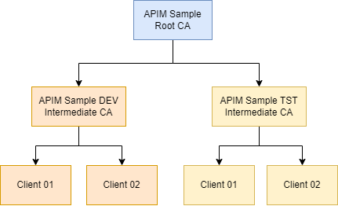

# 00 - Self Signed Certificates

The script [generate-client-certificates.ps1](./generate-client-certificates.ps1) can be used to generate the following self-signed certificate tree.

See the [certificates](./certificates) folder for the generated certificates. The `.pfx` files are password protected with the password `P@ssw0rd`.