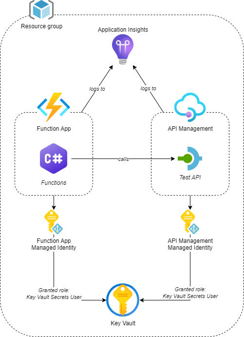

# Prerequisites

This is a diagram of the resources defined in [prerequisites.bicep](./prerequisites.bicep) that will be deployed as part of the prerequisites:



The [deploy-prerequisites.ps1](./deploy-prerequisites.ps1) script deploys the resources using the Azure CLI. It will:
- Create a new resource group if it does not exist.
- If `KeyVaultAdministratorId` is not provided, the script will get this data from the signed in user.
- Validate the deployment of the Bicep file to the resource group.
- Deploy the resources in the Bicep file to the resource group.

The `deploy-prerequisites.ps1` script has the following parameters:

| Parameter | Description | Default Value |
|-|-|-|
| Workload | The name of your workload. Maximum length is 12 characters. | N/A |
| Environment | The environment to deploy the resources to. | `dev` |
| Location | The location to deploy the resources to. | `norwayeast` |
| Instance | The instance of the workload. | `01` |
| ResourceGroupName | The name of the resource group to deploy the resources to. | Generated from the workload, environment, location, and instance. |
| KeyVaultAdministratorId | The object id of the user that should be added as an administrator to the key vault. | The object id of the logged in user. |

The workload, environment, location and instance are used to generate the names of the different resources, following the naming convention described on: https://learn.microsoft.com/en-us/azure/cloud-adoption-framework/ready/azure-best-practices/resource-naming

You can deploy the prerequisites using the following snippet:

```powershell
./deploy.ps1 -Workload '<your-workload>'
```
